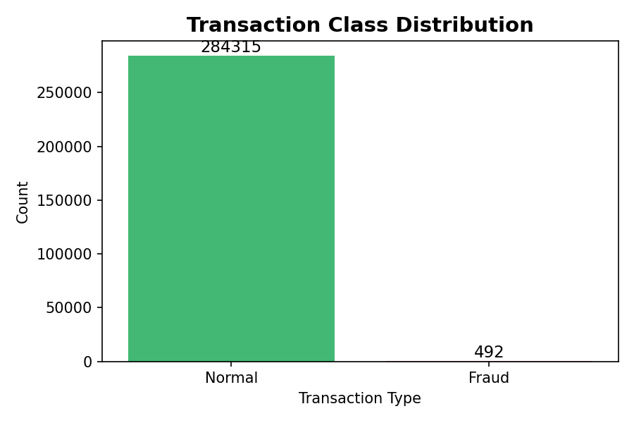
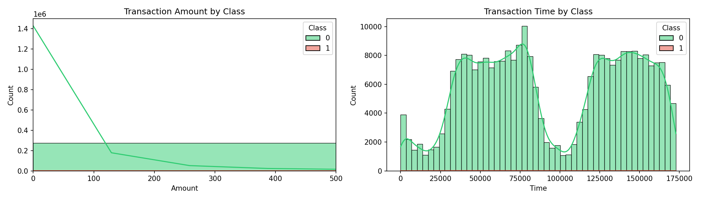
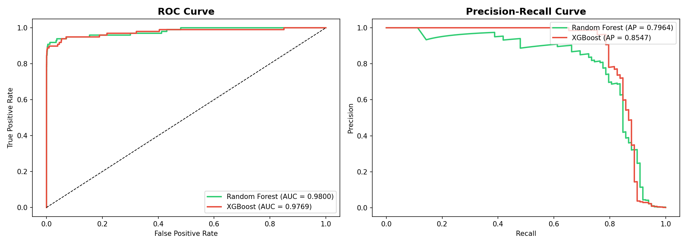
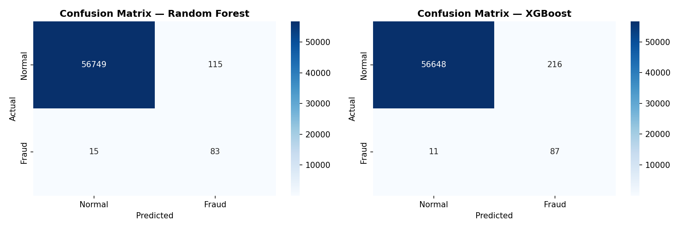
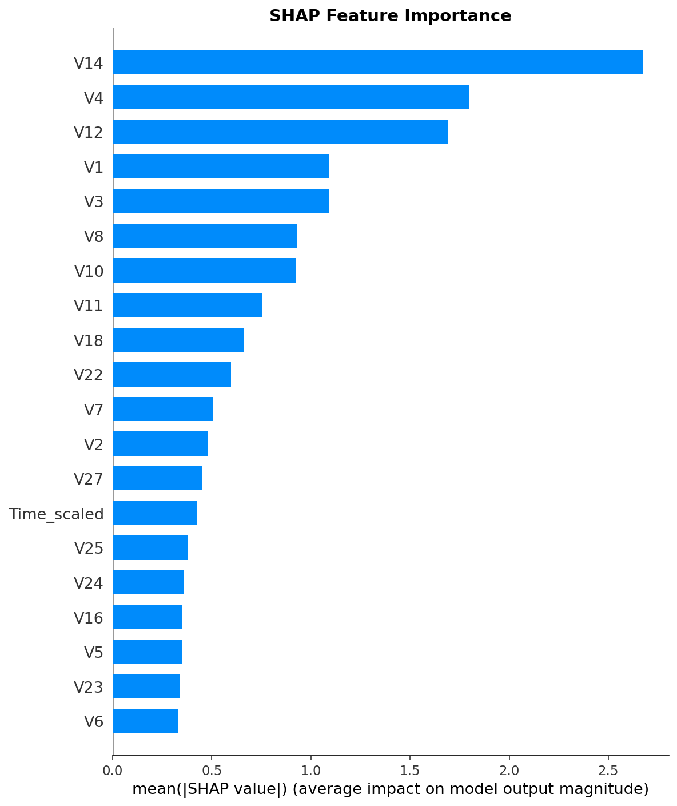

# Credit Card Fraud Detection

A machine learning project to detect fraudulent credit card transactions using **Random Forest** and **XGBoost** classifiers. The dataset is highly imbalanced (0.17% fraud), addressed via **SMOTE** oversampling, with model interpretability provided by **SHAP** analysis.

## Dataset

- **Source:** [Kaggle - Credit Card Fraud Detection](https://www.kaggle.com/datasets/mlg-ulb/creditcardfraud) (Machine Learning Group at ULB)
- **Size:** 284,807 transactions, 31 columns (28 PCA-transformed features V1–V28, Time, Amount, Class)
- **Class Balance:** 492 fraud (0.1727%) vs 284,315 legitimate (99.8273%)
- **Missing Values:** None

## Project Structure

```
├── data/
│   └── creditcard.csv              # Raw dataset (~144 MB)
├── models/
│   ├── random_forest_model.pkl     # Trained Random Forest model
│   └── xgboost_model.pkl           # Trained XGBoost model
├── notebooks/
│   └── fraud_detection.ipynb       # Full pipeline notebook
├── outputs/
│   ├── fraud_distribution.png      # Class distribution bar chart
│   ├── amount_time_distribution.png
│   ├── roc_pr_curves.png           # ROC & Precision-Recall curves
│   ├── confusion_matrices.png      # Confusion matrix heatmaps
│   └── shap_bar.png                # SHAP feature importance
├── requirements.txt
├── LICENSE
└── README.md
```

## Visualizations

### Class Distribution



The dataset is heavily imbalanced — only 0.17% of transactions are fraudulent.

### Amount & Time Distributions



Distribution of transaction amounts and time across fraudulent and legitimate transactions.

### ROC & Precision-Recall Curves



ROC-AUC and Precision-Recall curves comparing Random Forest and XGBoost performance.

### Confusion Matrices



Confusion matrix heatmaps for both models on the test set.

### SHAP Feature Importance



Top 10 features by mean SHAP value for the XGBoost model.

## Pipeline Overview

1. **Exploratory Data Analysis** — Visualize class imbalance, feature distributions
2. **Preprocessing** — StandardScaler on Amount/Time, 80/20 stratified train-test split
3. **SMOTE Oversampling** — Balance training classes (227,451 samples each)
4. **Model Training** — Random Forest (100 trees, max_depth=10) and XGBoost (200 estimators, scale_pos_weight=100)
5. **Evaluation** — ROC-AUC, Precision-Recall, confusion matrices, classification reports
6. **Interpretability** — SHAP feature importance on XGBoost
7. **Serialization** — Models saved via joblib

## Results

| Metric | Random Forest | XGBoost |
|---|---|---|
| ROC-AUC | **0.9800** | 0.9769 |
| Avg Precision | 0.7964 | **0.8547** |
| Precision (Fraud) | **0.4192** | 0.2871 |
| Recall (Fraud) | 0.8469 | **0.8878** |
| F1-Score (Fraud) | **0.5608** | 0.4339 |

- **Random Forest** — Better precision/F1, fewer false positives
- **XGBoost** — Higher recall catches more fraud, but at more false positives

## Installation

```bash
pip install -r requirements.txt
```

## Usage

```bash
jupyter notebook notebooks/fraud_detection.ipynb
```

Run all cells sequentially. The `outputs/` and `models/` directories are populated automatically.

> **Note:** The SHAP cell (~6 min on full test set of 56,962 samples) and the dataset (144 MB) require sufficient memory.

## License

This project is for educational/research purposes. The dataset is publicly available from ULB/Kaggle.
